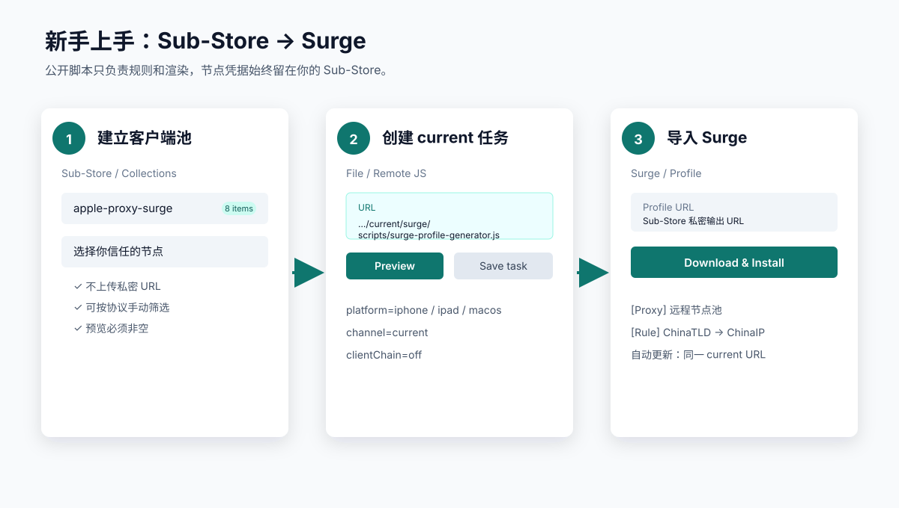
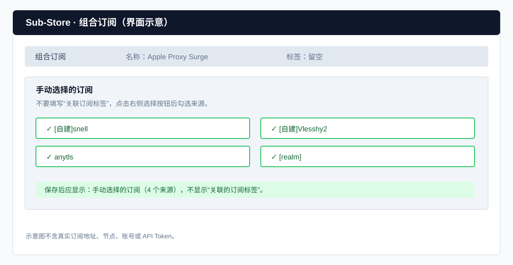
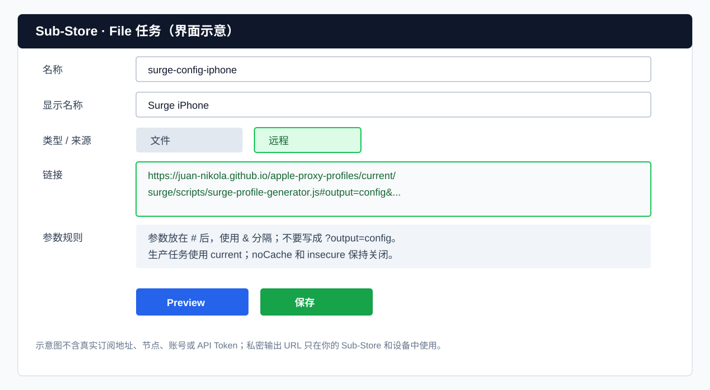
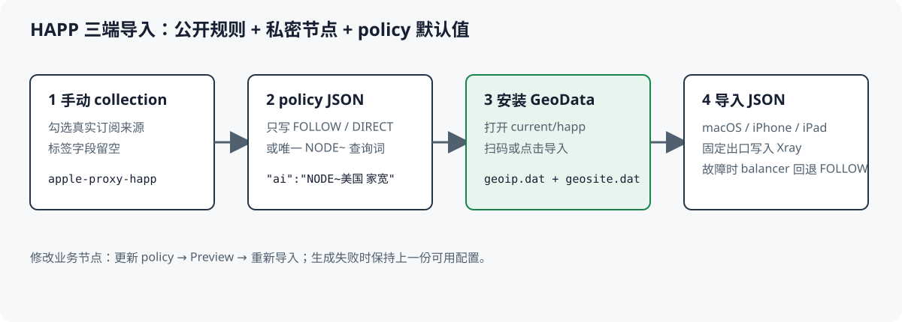
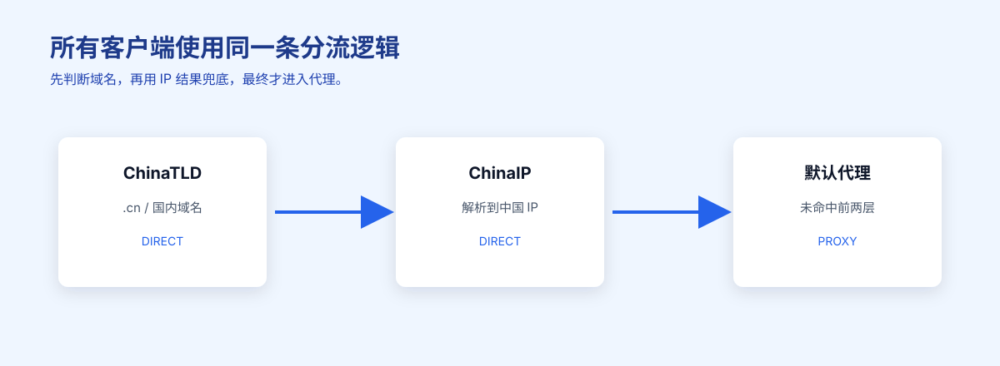
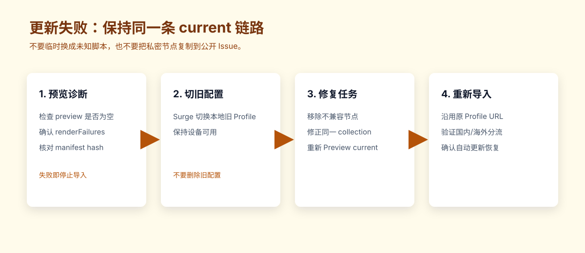

# Apple Proxy Profiles

把你在 Sub-Store 中选择的私密节点，转换成 Apple 设备可以直接导入的配置。仓库仍采用 monorepo：共享策略和协议放在 `shared/`，各客户端 renderer 放在 `clients/*`，自动化发布放在 `automation/`，公开产物只发布到 `public/current/`。

## 新手推荐：先用 Surge

如果你主要使用 iPhone、iPad 和 macOS，建议从 Surge 开始。它使用同一份 Profile、同一个远程节点池和同一条 `current` 更新地址，日常只需要点击更新，不需要手动复制节点。



上图中的 URL、节点和数量都是安全示意值。实际使用时，私密节点只存在于你自己的 Sub-Store，不能提交到仓库或公开聊天。

### 5 分钟上手

#### 1. 在 Sub-Store 建立 9 个手动 collection

创建以下 collection，并从你的来源中手动选择节点：

```text
apple-proxy-all
apple-proxy-egern
apple-proxy-anywhere
apple-proxy-shadowrocket
apple-proxy-surge
apple-proxy-singbox
apple-proxy-happ
apple-proxy-v2box
apple-proxy-clash
```

第一次建议只配置 `apple-proxy-surge`。选择节点时保留你确认可用的协议；不要把真实订阅 URL、UUID、密码或私钥写进 GitHub。



图中绿色勾选框代表你在“手动选择的订阅”列表中实际勾选的来源。所有 collection 都按这个方式配置；“标签”字段留空，保存后应看到“手动选择的订阅”，而不是“关联订阅标签”。另外建立一个私密 File task 输出 `apple-proxy-policy` JSON，这个任务不放节点。

#### 2. 创建 Surge Profile File task

在 Sub-Store 新建 File，选择远程脚本：

```text
https://juan-nikola.github.io/apple-proxy-profiles/current/surge/scripts/surge-profile-generator.js
```

参数填写：

```text
output=config
type=collection
name=apple-proxy-surge
subscriptionName=Apple-Proxy-Nodes
platform=iphone
dnsMode=stable
chinaDns=alidns
globalDns=cloudflare
blockMode=balanced
quicMode=proxy-block
ipv6Mode=ipv4-only
autoGroupMode=auto
clientChain=off
channel=current
```



新版界面中创建一个文件后，在“文件操作”里添加“脚本操作/Script Operator”，将 generator URL 填入脚本操作的“远程链接”；文件本身保持空内容，不要把 generator URL 填到“文件 → 远程”的源文件链接，否则 Preview 只会显示 JavaScript 源码。然后点击 Preview 和保存。仓库的 30 个 canonical task 已按同样字段组织；参数中的私密节点 URL 只填写在你自己的 Sub-Store，不要回填到 README 或 GitHub。

所有当前 canonical Profile task 都统一使用 `ipv6Mode=ipv4-only`，平台只通过 `platform` 区分：macOS 为 `macos`、iPhone 为 `iphone`、iPad 为 `ipad`。旧版 Sub-Store 如果只有一个 URL 输入框，把参数放在 `#` 后并用 `&` 分隔，不能写成 `?output=config`。

### Sub-Store 参数含义与可用值

脚本参数必须放在远程 JS 链接的 `#` 后，用 `&` 分隔。下面是本项目配置任务会用到的参数；“可用值”是生成器实际校验的值，不能自行改写成中文或其他拼写。

| 参数 | 含义 | 可用值 | 当前任务值 |
| --- | --- | --- | --- |
| `output` | 输出节点订阅还是完整配置 | `nodes`、`config` | 节点任务用 `nodes`，配置任务用 `config` |
| `type` | Sub-Store 数据来源类型 | `collection` | `collection` |
| `name` | 要读取的 collection 标识 | 你的 collection 名称 | 按客户端固定为对应的 `apple-proxy-*` |
| `subscriptionName` | 生成配置中引用的节点订阅显示名 | 任意非空单行文本 | 必须与节点 File 在客户端中的显示名完全一致 |
| `platform` | 目标客户端平台 | `macos`、`iphone`、`ipad`、`appletv`、`android`（按客户端限制） | 按任务平台填写 |
| `channel` | 公开脚本、规则和 GeoData 发布通道 | 当前生产只用 `current` | `current` |
| `dnsMode` | DNS 组合策略 | `stable`、`privacy`、`speed` | `stable` |
| `chinaDns` | 国内域名使用的 DNS | `alidns`、`dnspod`、`system` | `alidns` |
| `globalDns` | 境外域名使用的 DNS | `cloudflare`、`google`、`quad9` | `cloudflare` |
| `blockMode` | 安全、广告和跟踪规则的默认拦截强度 | `balanced`、`security`、`strict`、`off` | `balanced` |
| `quicMode` | UDP/443（QUIC）处理方式 | `allow`、`proxy-block`、`all-block` | `proxy-block` |
| `ipv6Mode` | DNS 和连接选择 IPv4/IPv6 的方式 | `auto`、`ipv4-only` | 所有 22 个配置任务均为 `ipv4-only` |
| `autoGroupMode` | 自动测速/地区分组的生成规模 | `auto`、`full`、`balanced`、`minimal` | `auto` |
| `clientChain` | 是否生成客户端链式入口/落地节点 | `off`、`on` | `off` |
| `adblockMode` | 是否加载完整广告规则包 | `off`、`full` | `off` |
| `nodeErrorMode` | sing-box 遇到不兼容节点时的处理 | `strict`、`compatible` | `strict` |
| `profileMode` | sing-box 配置模式 | `light`、`diagnostic` | `light` |
| `region` | V2Box GeoData 和地区规则区域 | `cn`、`global`、`ru`、`ir` | `cn` |

常用的私密引用参数也有固定边界：`nodeSubscriptionUrl`、`proxyPolicyUrl` 必须是你自己的 HTTPS 私密 URL，不能提交到仓库；V2Box 的 `clientChainTarget` 只有在 `clientChain=on` 时填写，并使用 `NODE:节点名` 格式；`policyOverrides` 是 V2Box 的可选业务策略覆盖，不需要时留空。

几个容易混淆的值：`ipv6Mode=auto` 会允许系统选择 IPv6，适合已经确认 IPv6 可达的网络；`ipv6Mode=ipv4-only` 会让生成配置优先、且仅使用 IPv4，适合没有可用 IPv6 路由或出现 `no route to host` 的网络。它能减少连接失败，但不会单独解决规则包过大造成的内存不足。`quicMode=proxy-block` 只阻止代理路径上的 QUIC，`all-block` 阻止全部 QUIC，`allow` 不添加阻止规则。`adblockMode=full` 会增加规则和内存占用，移动端保持 `off`。

Sub-Store 界面的“关闭缓存/noCache”和“不验证服务器证书/insecure”不是脚本参数：生产任务应保持 noCache 关闭、insecure 关闭。修改参数后必须重新 Preview、保存 File，再在客户端更新 Profile。

#### 3. Preview，再导入 Surge

点击 Preview，确认输出包含 `[General]`、`[Proxy]`、`[Proxy Group]` 和 `[Rule]`，并且没有 `renderFailures` 阻断项。然后复制 Sub-Store 生成的私密 Profile URL，在 Surge 中选择从 URL 下载并安装。

导入后应看到：

- `Remote Node Pool`：由同一个远程节点池自动更新；
- 国内域名和解析到中国 IP 的目标直连；
- 未命中业务规则和中国 IP 回落的目标进入 `漏网之鱼`；它的默认值由 `apple-proxy-policy` 的 `final` 控制；
- 规则和节点凭据没有被发布到公开 Pages。

#### 4. 设置统一业务节点

在 `apple-proxy-policy` 的私密 JSON 文件中按客户端分层设置默认值，只写节点大致名称，不写凭据。每个客户端层都使用相同的中文业务组映射；只有 Surge 的 AI 业务保持 `FOLLOW`，因为 Surge 当前不支持 VLESS：

```json
{
  "schemaVersion": 3,
  "clients": {
    "surge": {
      "schemaVersion": 2,
      "targets": {
        "ai": "FOLLOW",
        "github": "FOLLOW",
        "youtube": "FOLLOW",
        "overseasMedia": "FOLLOW",
        "globalSocial": "FOLLOW",
        "apple": "DIRECT",
        "microsoft": "DIRECT",
        "domesticPlatform": "DIRECT",
        "overseasGame": "FOLLOW",
        "game": "DIRECT",
        "download": "DIRECT",
        "dnsAndRules": "FOLLOW",
        "final": "FOLLOW"
      }
    },
    "sing-box": {
      "schemaVersion": 2,
      "targets": {
        "ai": "NODE~🇺🇸qqpw家宽|vless",
        "github": "FOLLOW",
        "youtube": "FOLLOW",
        "overseasMedia": "FOLLOW",
        "globalSocial": "FOLLOW",
        "apple": "DIRECT",
        "microsoft": "DIRECT",
        "domesticPlatform": "DIRECT",
        "overseasGame": "FOLLOW",
        "game": "DIRECT",
        "download": "DIRECT",
        "dnsAndRules": "FOLLOW",
        "final": "FOLLOW"
      }
    }
  }
}
```

示例只展开 Surge 和 sing-box；实际 policy 必须包含 `anywhere`、`egern`、`shadowrocket`、`surge`、`sing-box`、`happ`、`v2box`、`clash` 八个客户端层，每层都必须完整填写 13 个 target。业务组名称固定为 `🤖 AI 专用`、`🐙 GitHub`、`📺 YouTube`、`🎬 海外流媒体`、`💬 海外社交`、`🍎 Apple`、`🪟 Microsoft`、`🇨🇳 国内平台`、`🌍 海外游戏`、`🎮 游戏连接`、`⬇️ 下载/P2P`、`🧭 DNS 与规则下载`、`漏网之鱼`。

`final` 支持 `FOLLOW`（默认使用 `🚀 节点选择`）、`DIRECT`（默认直连）和 `NODE~查询词`（默认固定到唯一匹配节点）。`漏网之鱼` 始终提供 `🚀 节点选择`、`DIRECT`、`REJECT` 三个手动选项，`REJECT` 不会成为默认值；旧 JSON 中的 `最终兜底` 仍可作为 `final` 的兼容键。`NODE~` 必须唯一命中；零个或多个候选都会拒绝生成，不会自动猜节点。节点显示名中的地区旗帜、协议（例如 `· VLESS`）和 UDP 能力（例如 `·U`）由生成器自动追加，策略匹配的是原始节点名。节点原始名称相同但协议不同的时候，在查询词后加 `|协议`，例如 `NODE~qqpw家宽|vless`；协议限定大小写不敏感，但必须是项目支持的协议。Surge、sing-box、Egern、Shadowrocket、Clash 会把结果写入业务组默认位置，仍允许你在客户端内切换；Anywhere 的 `anywhere-strategy` 只输出脱敏的 `localAssignments` 核对结果，不能通过远程文件自动导入业务组绑定或 `漏网之鱼` 默认出口，必须在 App 内手动设置。HAPP 和 V2Box 会把结果写入生成后的 Xray 路由，修改后需要重新 Preview。固定节点不存在或不兼容时会直接失败，不会静默换节点。

#### 5. HAPP 导入顺序（避免“无法解析配置”）

HAPP 必须通过真实订阅 URL 获取 JSON 数组和响应头。不要点击 Sub-Store 的 Preview 下载 JSON，再走“文件导入节点”；本地文件没有 `routing` 响应头，部分 HAPP 版本也不接受数组文件。



正确顺序：

1. 打开 `current/happ/index.html`，扫码或点击链接安装 GeoData。
2. 在 Sub-Store 复制对应平台的私密 **File URL**。
3. 在 HAPP 的“添加订阅/URL”中粘贴 URL，等待 `routing` Profile 和 GeoData 完成。
4. 重新连接。JSON 订阅设置里的路由开关显示锁定是正常的，路由由 JSON 和订阅响应头共同控制。

生成器会同时发送 `routing: happ://routing/onadd/...` 和 `routing-enable: 1`：前者绑定并自动激活 Profile，后者明确保持路由开启。macOS 任务还发送 HAPP 官方 `proxy-enable: 1`，导入/更新时自动打开桌面 Proxy 模式；iPhone/iPad 使用 Network Extension。若使用本地文件，只能作为离线兜底，不能保证自动绑定或自动启用。

HAPP 对 JSON 订阅会把路由显示为“开”并锁定，点击时提示“无法手动启用/禁用路由”属于正常限制。请以日志中的 `happ-direct`、`happ-follow/<节点展示名>` 和 `happ-fixed/<节点展示名> [candidate]` 判断路由结果；`proxy-block` 会让应用 UDP/443（QUIC）直连回落，避免送入仅支持 TCP 的 Reality。

HAPP 日志默认级别为 `info`。入口会嗅探 `http`、`tls`、`quic` 并以 `routeOnly:false` 写回目标，因此嗅探成功时可看到 `chat.openai.com` 等域名；纯 IP、未加密 TCP、ECH 或嗅探失败时显示 IP 属于正常边界。出站会显示脱敏节点名，例如 `happ-follow/小秘书GEN2 · VLESS · U`，重复名称才追加短 ID。macOS 需将系统 HTTP/HTTPS 代理设为 `127.0.0.1:10809` 或 SOCKS `127.0.0.1:10808`，可用 `scutil --proxy` 检查；其他代理软件抢占系统代理时，应用不走 HAPP 不属于路由规则故障。

#### 6. 日常更新与回滚

HAPP 首先打开 `current/happ/index.html` 扫码或点击链接安装 GeoData，再通过 HAPP 的“添加订阅/URL”导入对应平台的私密 File URL。macOS 导入最新任务后会自动启用桌面 Proxy；旧任务需删除后重新导入。固定节点故障时仅 balancer 在运行时回退到 FOLLOW；若 policy 解析失败，生成器直接失败并保留上一份可用配置。



#### 7. 日常更新

Surge 中保留同一个 Profile URL，按客户端的更新按钮即可。公开规则更新不会改变你的 Sub-Store collection；节点变化只需要更新对应 collection 后再次 Preview。

#### 8. 出错时回滚

先在设备上切回本地旧 Profile，确认网络恢复；再回到同一个 Sub-Store task 修正不兼容节点并重新 Preview。不要临时改用未知脚本，也不要删除旧 Profile。



## 八个 active 客户端

| 推荐顺序 | 客户端 | 适合场景 |
| --- | --- | --- |
| 1 | Surge | iPhone、iPad、macOS，最无感的默认方案 |
| 2 | Shadowrocket | 轻量备用和快速节点订阅 |
| 3 | Egern | Apple 原生规则深度定制 |
| 4 | sing-box | 高级用户和跨平台 |
| 5 | Clash Apple | Mihomo/Clash 生态 |
| 6 | Anywhere | `.arrs` 规则和手动绑定 |
| 7 | HAPP | macOS、iPhone、iPad，Xray JSON 固定业务出口 |
| 8 | V2Box | Xray 兼容路线；使用共享 GeoData |

OneXray、v2rayN 保持移除。HAPP 的稳定 GeoData URL 为 `public/current/happ/geoip.dat` 和 `public/current/happ/geosite.dat`；V2Box 的 GeoData URL 继续保持 `public/current/geodata/<region>/`。

## 统一行为

- unified policy 使用 schema v3 按客户端分层；每层嵌套 schema v2 的完整 13 项 targets，schema v1/v2 仅作为兼容读取器。
- 所有客户端使用同一 routing plan：`ChinaTLD -> ChinaIP -> 漏网之鱼`；`final` 只控制未命中业务规则后的最终出口。
- Surge 使用单远程节点池，避免 Profile 和节点订阅漂移。
- 只发布 `current`，采用原子发布并保留 `previous` 回滚数据。
- 节点严格失败关闭；来源、哈希和规则审计写入 manifest。
- 公开规则与私密节点彻底分离。

## Sub-Store 规模

当前 canonical catalog 为 9 个手动 collection、30 个 File task：

| 客户端 | 任务数 | 输出 |
| --- | ---: | --- |
| Egern | 4 | 节点 + macOS/iPhone/iPad Profile |
| Anywhere | 2 | 节点 + strategy |
| Shadowrocket | 4 | 节点 + macOS/iPhone/iPad Profile |
| Surge | 4 | 节点资源 + macOS/iPhone/iPad Profile |
| sing-box | 4 | macOS/iPhone/iPad/Android Config |
| HAPP | 3 | macOS/iPhone/iPad JSON Config |
| V2Box | 3 | 节点 + iPhone/iPad Config |
| Clash Apple | 5 | 节点 + 四个平台 Config |
| Unified policy | 1 | schema v3 按客户端分层的私密 policy |

后台只保留上述 9 个手动 collection 和 30 个 canonical task；删除旧的 OneXray/v2rayN 对象及其任务。不要在 Sub-Store 使用 `subscriptionTags` 自动识别，所有节点来源通过 collection 手动勾选。

## 维护与验证

```bash
npm test
npm run build
npm run check:actions
npm run check:secrets
npm run verify
```

更多 Sub-Store 参数见 [`docs/substore-two-layer-setup.md`](docs/substore-two-layer-setup.md)，维护流程见 [`docs/maintenance.md`](docs/maintenance.md)。
